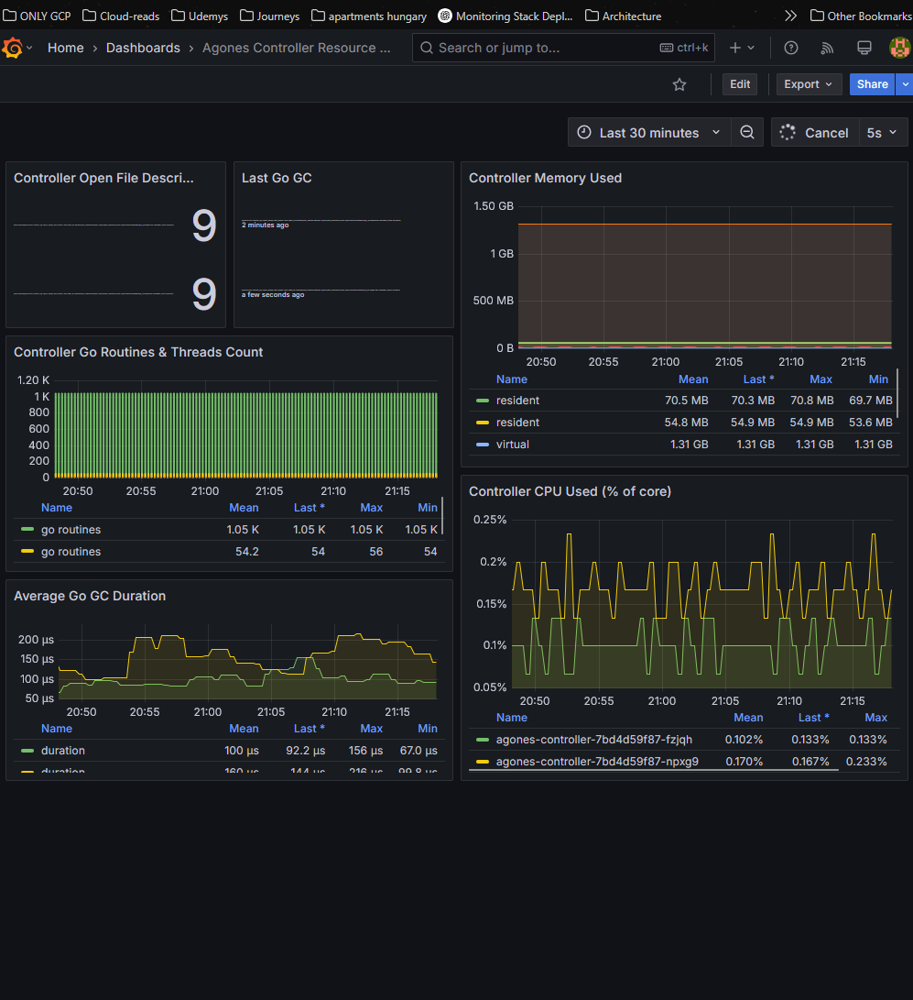

# Deploying a Highly Available Game Server Cluster on GKE with Agones
### What is Agones?

Agones provides a plug-and-play solution for deploying and managing game servers on Kubernetes. It simplifies the process of provisioning and scaling game servers by abstracting it's CRD's behind a well written operator. This allows infrastructure teams to focus on simple requirements, without needing to manage complex networking or manual server scaling.

Key features
- **Simplified Deployment** – Deploy game servers with minimal configuration, specifying only the **image, ports, and storage** needed.
- **Dynamic Scaling** – Agones manages **replica scaling**, ensuring game servers are available as player demand fluctuates.
- **Automated Port Management** – Dynamically assigns node ports, enabling direct connections to servers from their respective hosts without randomized routing.
- **API Integration** – Can be integrated with APIs to handle matchmaking and routing logic for game server allocation.

In short...
Agones offers a ready-to-use framework for hosting almost any kind of game server while leveraging the scalability and automation of cloud computing with minimal setup

Read the Well written Official Documentation here:
- https://agones.dev/site/docs/
- https://agones.dev/site/docs/getting-started/create-fleet/
- https://agones.dev/site/docs/installation/install-agones/helm/

---
### Deployment Steps

#### Step 1: Properly configure your underlying cluster

Ensure that your Kubernetes cluster has private nodes disabled `enable_private_nodes = false`. This allows Agones' networking CRDs to correctly assign node ports to each GameServer pod in your deployments.

This setup provides each GameServer with a unique, directly requestable ID, rather than relying on round-robin load balancing for request distribution. It can be integrated with an API that manages routing logic to dynamically allocate and direct traffic to the appropriate GameServer.

``` python
  private_cluster_config {
    enable_private_endpoint = false
    enable_private_nodes    = false #sometimes true
    master_ipv4_cidr_block  = "172.16.0.0/28"
  }
```
*Upon use of `kubectl get node -o wide` you should see an external address for your nodes.*

#### Step 2: Create a Firewall Rule for Game Server Traffic

Before deploying game servers with Agones, we need to configure a firewall rule that allows incoming UDP traffic to reach the Kubernetes cluster's nodes. This ensures that game clients can connect to the game servers hosted within the cluster.

```python
#Game-Server-Health-and-traffic
resource "google_compute_firewall" "game-cluster" {
  name        = "galaxy-grants-wandering-star"
  network     = var.network.name
  allow {
    protocol = "udp"
    ports    = ["7000-8000"]
  }

  source_ranges = ["0.0.0.0/0"]
  depends_on = [ google_compute_network.net-1 ]
}
#>>>
```

#### Step 3: Installing the operator through Helm

After setting up the firewall rules, you need to **install and deploy Agones** in your Kubernetes cluster using Helm. This step ensures that the **Agones CRDs, controllers, and networking components** are properly configured.

Commands:
```shell
helm repo add agones https://agones.dev/chart/stable
helm repo update
helm install my-release --namespace agones-system --create-namespace agones/agones
```
Now we can deploy game servers to the default namespace!

Verify correct instillation using the following command:
```shell
User@Caranthir MINGW64 /c/terraform/anton/module-practice/02-game-servers/test
$ kubectl get pods -n agones-system
NAME                                 READY   STATUS    RESTARTS   AGE
agones-allocator-6c6d8b7549-4drb2    1/1     Running   0          14m
agones-allocator-6c6d8b7549-cssdp    1/1     Running   0          14m
agones-allocator-6c6d8b7549-tsmn7    1/1     Running   0          14m
agones-controller-5b5c58c7d9-f9dvz   1/1     Running   0          14m
agones-controller-5b5c58c7d9-rqbx2   1/1     Running   0          14m
agones-extensions-8bdfd6bb5-g7k4j    1/1     Running   0          14m
agones-extensions-8bdfd6bb5-h99s6    1/1     Running   0          14m
agones-ping-7b766cc5db-5552l         1/1     Running   0          14m
agones-ping-7b766cc5db-cvl7s         1/1     Running   0          14m

```

---
##### Basic Server YAML Setup 

My Below Yaml Template serves as a configurable example for templating servers within this operator. I designed this by editing the template found in the documentation. I integrated the tools I already had existing in my environments.

Through modifying the below points, this YAML example can be configured to host any type of game server.

Key Takeaways:
- Define `containerPort` for the pods and the service to match the port request of your specific game server image.
- Change the `mountPath` in volume mounts to match the expected data paths for your server image of choice. *In my example the default test path for server data is `/home/Agones`*
- Make sure your configured service is set to translate UDP traffic

Deployment YAML Template
```python
apiVersion: agones.dev/v1
kind: Fleet
metadata:
  name: type-a
  namespace: default  # Change if needed
spec:
  replicas: 3
  template:
    metadata:
      labels:
        app: type-a
    spec:
      ports:
      - name: default
        containerPort: 7654
#        hostPort: 7654  only turn on when using a Static port policy
        portPolicy: Dynamic 
        protocol: UDP
      template:
        spec:
          containers:
          - name: simple-game-server
            image: us-docker.pkg.dev/agones-images/examples/simple-game-server:0.36
            volumeMounts:          
            - name: orbiter-module
              mountPath: /home/Agones
          volumes:
          - name: orbiter-module
            persistentVolumeClaim:
              claimName: orbiter-module
  strategy:
    type: RollingUpdate
    rollingUpdate:
      maxSurge: 25%
      maxUnavailable: 25%
---
apiVersion: v1
kind: PersistentVolumeClaim
metadata:
  name: orbiter-module
  namespace: default
spec:
  accessModes: ["ReadWriteOnce"]
  resources:
    requests:
      storage: 1Gi
  storageClassName: "bordeaux"
```

---
#### Step 4 : Executing the deployment of a server fleet

If using my repository, simply apply the `/apply-me/` folder to deploy the Agones fleet and observe the results. 

`kubectl apply -f apply-me/`
Use the below commands and observe the below outputs from a successful deployment.
``` shell
User@Caranthir MINGW64 /c/terraform/anton/module-practice/02-game-servers
$ kubectl get fleet -n default
NAME     SCHEDULING   DESIRED   CURRENT   ALLOCATED   READY   AGE
type-a   Packed       2         2         0           2       48s

User@Caranthir MINGW64 /c/terraform/anton/module-practice/02-game-servers
$ kubectl get gameservers -n default
NAME                 STATE   ADDRESS       PORT   NODE                                             AGE
type-a-tsnhl-57cvh   Ready   34.32.70.90   7308   gke-atreides-war-fleet-sardaukar-257007bd-75fv   3s
type-a-tsnhl-ggjwp   Ready   34.32.70.90   7972   gke-atreides-war-fleet-sardaukar-257007bd-75fv   2m33s
type-a-tsnhl-rnccn   Ready   34.32.70.90   7424   gke-atreides-war-fleet-sardaukar-257007bd-75fv   3s
# Notice addresses on our pods
```

###### Validating Server Functionality
Within the top directory, you'll find a Python script (test-script.py) designed to send a request to the deployed game server and validate its response.

Edit & Run the script to initiate a test request on our live servers:
```python
import socket

server_ip = "34.32.70.90" # Change to IP address assigned to pod
server_port = 7972 # Change to the port of the server you want to test
message = "Hello from outside"

# Create UDP socket
sock = socket.socket(socket.AF_INET, socket.SOCK_DGRAM)

try:
    # Send the message
    print(f"Sending: '{message}' to {server_ip}:{server_port}")
    sock.sendto(message.encode(), (server_ip, server_port))

    # Set timeout to avoid hanging
    sock.settimeout(5)  # 5 seconds timeout

    # Try to receive a response (if the server replies)
    try:
        response, addr = sock.recvfrom(1024)  # Buffer size of 1024 bytes
        print(f"Received from {addr}: {response.decode()}")
    except socket.timeout:
        print("No response received (you might be ugly)")

finally:
    sock.close()
    print("Connection closed.")


```

#### Step 5 : Testing 

Use the below Command and observe the below output from a successful request:
``` shell
User@Caranthir MINGW64 /c/terraform/anton/module-practice/02-game-servers
$ python test-script.py
Sending: 'Hello from outside' to 34.32.70.90:7972
Received from ('34.32.70.90', 7972): ACK: Hello from outside

Connection closed.
```


And now we have a sure fire way of building out many varieties of gaming server. We need only change images and container ports per new configuration. 

Feel free to experiment and share your learnings.

---

# Monitoring Implementation Using Prometheus and Grafana

We follow the official guide to deploy a monitoring stack that seamlessly integrates within the cluster.



 **Prometheus Installation**
- We will install the Prometheus Operator using its Helm chart and provision a persistent volume for data retention which will use it's own storage class labeled `colder-storage.yaml`.
- Our Prometheus instance, configured via the provided YAML file, will scrape all Agones instances within the cluster. This is achieved through labels automatically assigned to Agones instances by the operator.

 **Grafana Deployment**
- Grafana will be installed using its Helm chart.
- We will configure Grafana with prebuilt dashboards stored as ConfigMaps in the `grafana-dashboards` folder.
- These dashboards, designed by Agones, filter and visualize the unique data generated by its operator and instances, providing instantly actionable metrics. If you've ever designed and tested custom queries, you'll appreciate the convenience of these preconfigured dashboards.

Official documentation
https://agones.dev/site/docs/guides/metrics/

---
### Prometheus Installation

1. Add Prometheus into your helm repository:
```shell
helm repo add prometheus-community https://prometheus-community.github.io/helm-charts
```

2. Update all items within your repository:
```shell
helm repo update
```

3. Use the following template to create an instance with an attached persistent disk using our template. - *I'm limiting the disk size to 10gb for demonstration purposes*

Make sure you run this command from within the monitoring directory
``` shell
helm upgrade --install prom prometheus-community/prometheus --namespace metrics --create-namespace \
    --set server.global.scrape_interval=30s \
    --set server.persistentVolume.enabled=true \
    --set server.persistentVolume.size=10Gi \
    --set server.persistentVolume.storageClass="agones-prom-store" \
    -f ./prometheus.yaml
```
*"For resiliency it is recommended to run Prometheus on a dedicated node which is separate from nodes where Game Servers are scheduled. If you use the above command, with our to set up Prometheus, it will schedule Prometheus pods on nodes tainted with ``agones.dev/agones-metrics=true:NoExecute`` and  labeled with ``agones.dev/agones-metrics=true`` if available."*
- *Meaning if you label a separate node as above our deployment steps will automatically separate Prometheus unto a different node from our cluster workloads*

4. Access the application and check for coverage using the below command in a separate terminal from your working terminal. 
```shell
kubectl port-forward deployments/prom-prometheus-server 9090 -n metrics
```

---
### Grafana Installation

1. We begin by saving our dashboards within our cluster's config map for dynamic use of our grafana pod. 
```shell 
kubectl apply -f grafana-dashboards
```
* *Be sure to execute from the metrics folder; We save time and effort by avoiding manual configuration*

2. Now add Grafana to your helm repository
```shell
helm repo add grafana https://grafana.github.io/helm-charts
```

3. Update your repositories
```shell
helm repo update
```

4. Install using your desired admin password
```shell
helm upgrade --install --wait grafana grafana/grafana --namespace metrics \
  --set adminPassword=admin -f ./grafana.yaml
```

5. Finally connect to your Grafana instance using port forwarding.   
```shell
kubectl port-forward deployments/grafana 3000 -n metrics
```

You can now view your active metrics by taking a look at your dashboards within Grafana after logging in. If you're on a higher level, free to design and implement your own dashboard configurations. 

---
## Key Troubleshooting Takeaways Learned from Deploying these Monitoring Tools

**Resource Requests & Scheduling Behavior**
- Even if Kubernetes has plenty of CPU headroom, the scheduler only considers requested resources—not actual usage.
- If workloads request CPU/memory, those resources are reserved, even if they remain idle.
- To Kubernetes, reserved resources are unavailable for other workloads, leading to scheduling failures even when actual usage is low.
- Be fine-grained and careful with resource requests—only request the minimum necessary.
- Set reasonable limits to allow workloads to burst when needed but keep requests low to improve scheduling efficiency.

**StorageClasses & PVC Scheduling**
- The `volumeBindingMode` setting significantly impacts PVC scheduling:
- `Immediate` → The PV is provisioned as soon as the PVC is created, potentially before the workload is scheduled.
- `WaitForFirstConsumer` → The PV is only provisioned when a pod requesting the PVC is scheduled, ensuring node affinity but potentially causing scheduling delays.
- If a PVC is bound to a PV in a specific zone, workloads requesting it must schedule in the same zone.

Truly a pain in the ass for me to fix haha

---
# The Agones Autoscaler

### Don't we already have a GKE native Autoscaler?

Yes, but agones offers a specialized solution for autoscaling that integrates with its operator-specific logic for usage and allocation. More specifically, based on the configured game server logic, once a server instance is considered Allocated or occupied with too many client connections, the Agones Autoscaler will dynamically deploy and delete instances to maintain the desired state of available game servers.

To fine-tune this behavior, Agones provides control over the buffer size, which dictates the minimum number of Ready game server instances that should always be available. Unlike traditional autoscalers that react to CPU or memory thresholds, Agones scales based on game server state transitions—ensuring that new instances are provisioned when existing servers become Allocated and removing idle instances when they exceed the buffer limit. This approach prevents players from experiencing delays due to cold starts while optimizing resource usage by scaling down unused capacity.

By carefully configuring buffer size, min/max replicas, and scaling strategy, you can tailor Agones autoscaling to match your workload’s concurrency and player demand patterns, ensuring a balance between availability, performance, and cost efficiency.

Official Documentation:
- https://agones.dev/site/docs/getting-started/create-fleetautoscaler/
- https://agones.dev/site/docs/reference/fleetautoscaler/

---
*See the below example, when applied after implementing the previous steps you should notice the cluster reduce it's size to accommodate your buffer size.*
```yaml
apiVersion: autoscaling.agones.dev/v1
kind: FleetAutoscaler
metadata:
  name: simple-game-server-autoscaler
spec:
  fleetName: type-a # BE CERTAIN TO MATCH THE NAME OF DESIRED FLEET TO SCALE
  policy:
    type: Buffer
    buffer:
      bufferSize: 2
      minReplicas: 0
      maxReplicas: 10
```

This configuration ensures that at least **two game server instances** are always **Ready**, with the Autoscaler adjusting the fleet size dynamically between 0 and 10 instances depending on player demand.

1. To deploy this YAML; change directories to the top level of my Repo and run the following command to deploy the auto scaler.
```shell
kubectl apply -f auto-scaling
```

Output Examples: - *Notice how my fleet size changes after yaml tinkering*
```shell
User@Caranthir MINGW64 /c/terraform/anton/module-practice/02-game-servers
$ kubectl get gameservers -n default
NAME                 STATE   ADDRESS       PORT   NODE                                             AGE
type-a-sj9d9-2rvmf   Ready   34.32.90.85   7941   gke-atreides-war-fleet-sardaukar-58e5df25-tpmk   4h13m
type-a-sj9d9-cl525   Ready   34.32.90.85   7881   gke-atreides-war-fleet-sardaukar-58e5df25-tpmk   11s
type-a-sj9d9-gwgt5   Ready   34.32.90.85   7840   gke-atreides-war-fleet-sardaukar-58e5df25-tpmk   4h13m
type-a-sj9d9-pbcz7   Ready   34.32.90.85   7241   gke-atreides-war-fleet-sardaukar-58e5df25-tpmk   4h13m

User@Caranthir MINGW64 /c/terraform/anton/module-practice/02-game-servers
$ kubectl apply -f auto-scaling/
fleetautoscaler.autoscaling.agones.dev/simple-game-server-autoscaler configured

User@Caranthir MINGW64 /c/terraform/anton/module-practice/02-game-servers
$ kubectl get gameservers -n default
NAME                 STATE   ADDRESS       PORT   NODE                                             AGE
type-a-sj9d9-gwgt5   Ready   34.32.90.85   7840   gke-atreides-war-fleet-sardaukar-58e5df25-tpmk   4h13m
type-a-sj9d9-pbcz7   Ready   34.32.90.85   7241   gke-atreides-war-fleet-sardaukar-58e5df25-tpmk   4h13m
```

That's all I have for now, Any additional updates will be provisioned beneath this section ;)

---